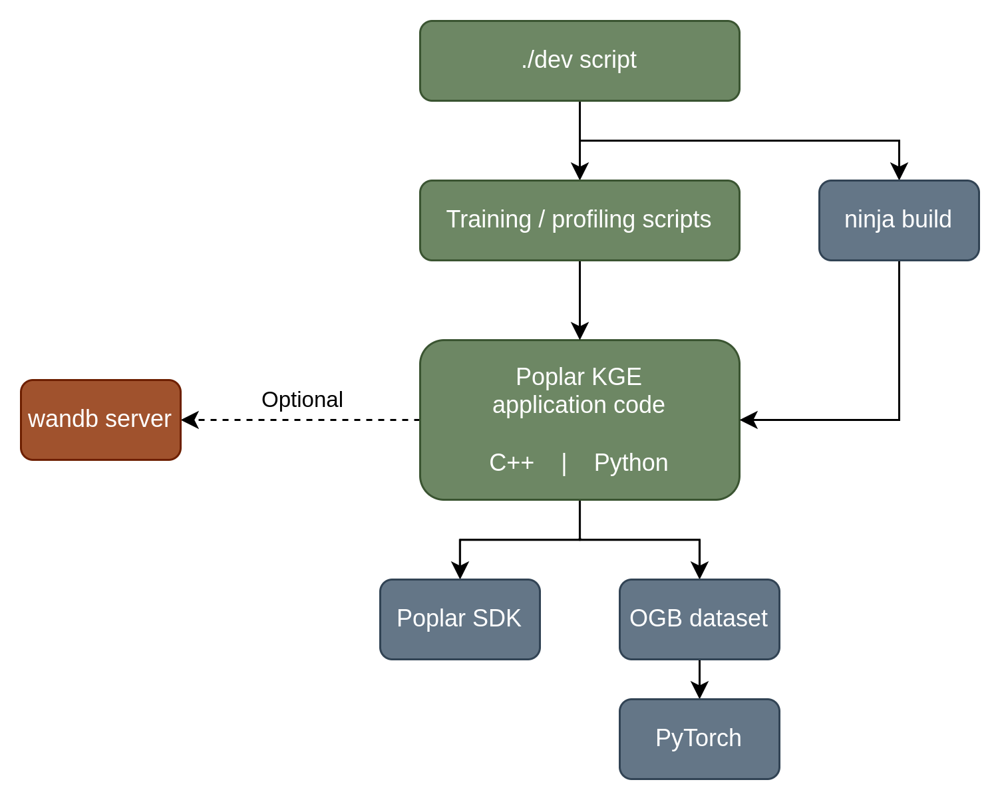

# The design of Poplar KGE, PAG & Fructose

This document covers code structure and design, for a detailed description of the models and execution scheme, please see our [technical report]().

## System architecture

The core model & training code is written in a combination of C++ and Python. The C++ code is build using ninja, and automated using a custom standalone Python script called `./dev`. We recommend consulting the [./dev source code](../dev) if the build process is unclear or problematic.

At runtime, the Python code requires `libpoplar_kge.so` from `build/`, `src/python` and `tests/python` to be available on the Python path. Optionally, the commands `./dev train` or `./dev python ...` can be used; these will check the C++ library is up-to-date before adding the required paths.

We use WandB to track experiments and manage sweeps, however this is optional and the code can be run locally as required (using `settings.logging.wandb = False`).

## Internal architecture

Internally the C++ code is divided up into "mini-libraries" which each have a simple responsibility. These are _not intended for direct reuse_, but may be a useful starting point for further work or similar projects.

In the diagram below, the most application-specific code is shown in green, generic mini-libraries are shown in brown and external dependencies in blue. Briefly:

 - Poplar KGE (poplar_kge*.py, poplar_kge.[ch]pp) is a monolithic training system for distributed KGE training and evaluation. It contains all model-specific and training-specific code.
 - Fructose is a syntactic sugar and ease-of-use layer on top of PAG, providing an API similar to machine learning frameworks for constructing Poplar progams.
 - Poplar AutoGrad (PAG) is a low-level automatic differentiation layer for PopLibs. It presents a PopLibs-like interface that allows generation of the backwards pass of composed PopLibs functions using the chain rule.

